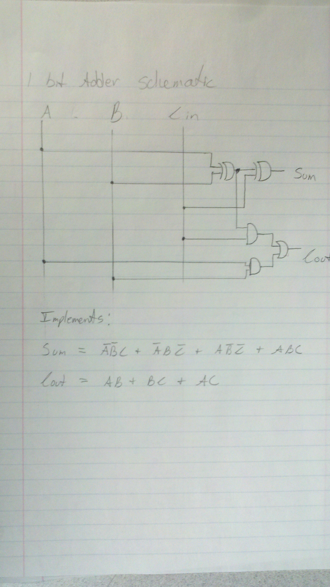
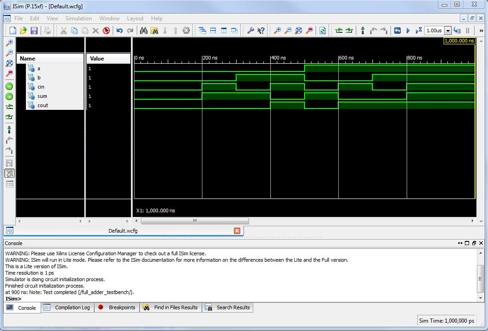
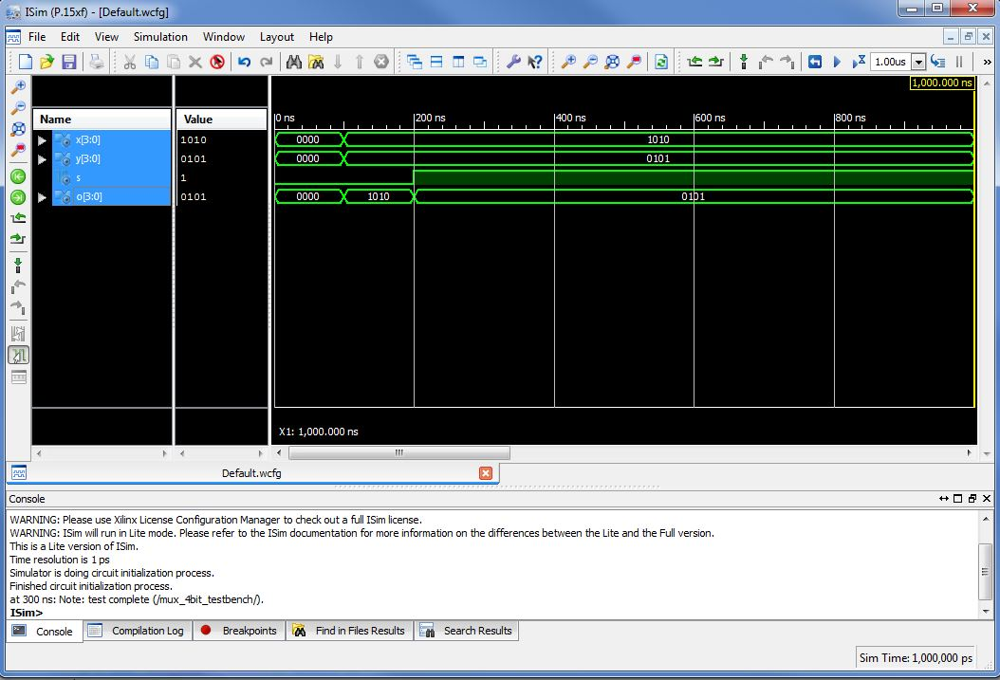
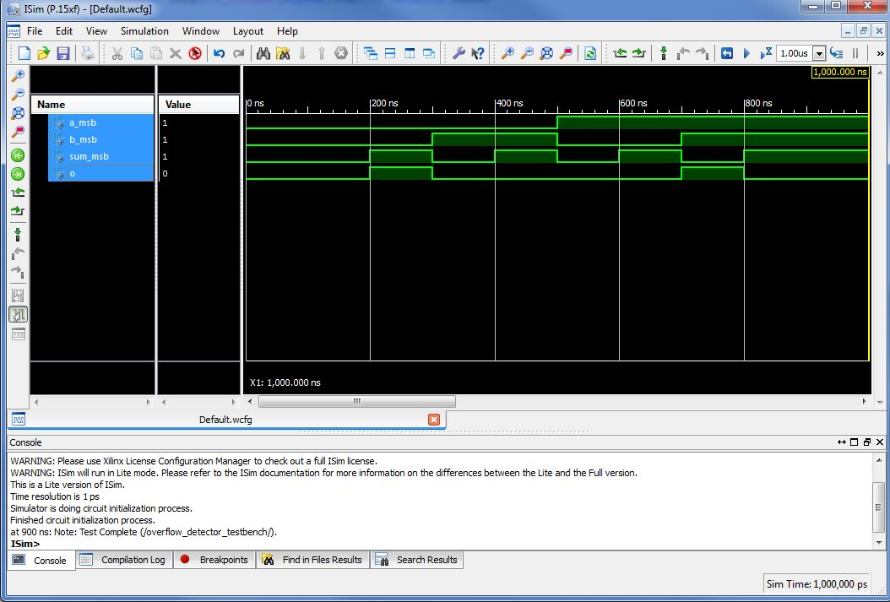
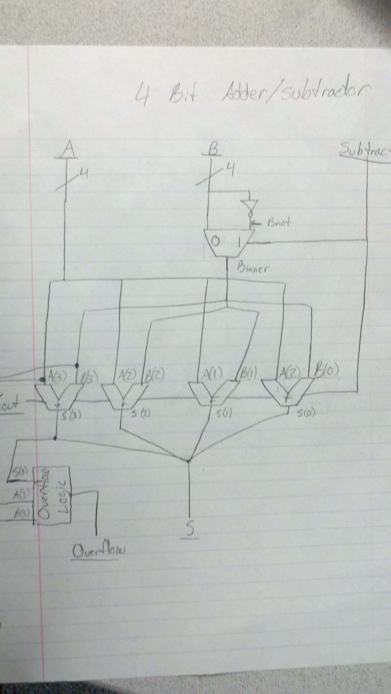
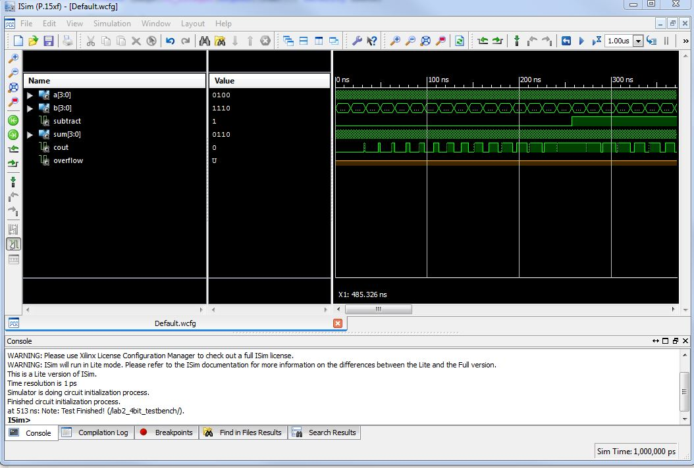

ECE281_Lab2
===========

In this lab you will build an adder/subtractor. This block is a critical piece of an Arithmetic Logic Unit (ALU), which is the computational “brain” of a computer. 

## Design Process

To implement the full 4bit adder/subtractor I broke the problem down into its basic pieces. These pieces came from the ALU design discussed in class. My design left out the AND, OR, XOR and comperator function of a the aforementioned ALU. This simplified ALU consisted of an adding component, a multiplexer component, and an overflow detecting component. The inputs were two 4bit numbers and a toggle for subtraction. The outputs were a carry out, an overflow indicator, and the sum. 

### 1bit Full Adder Design

The 1bit full adder was a necessary subcomponent of the final 4bit full adder. This component was designed according to the schematic discussed in class. Its truth table and schematic follow:

#### Truth Table

| A | B | Cin | Sum | Cout |
|---|---|-----|-----|------|
| 0 | 0 |  0  |  0  |   0  |
| 0 | 0 |  1  |  1  |   0  |
| 0 | 1 |  0  |  1  |   0  |
| 0 | 1 |  1  |  0  |   1  |
| 1 | 0 |  0  |  1  |   0  |
| 1 | 0 |  1  |  0  |   1  |
| 1 | 1 |  0  |  0  |   1  |
| 1 | 1 |  1  |  1  |   1  |

#### Schematic

#### Testing

A self-testing testbench was written for the 1bit adder. Each possible input and the correct output was tested for by use of the assert statement. Below are the simulation results:

### 4bit Adder Design

The 4bit adder was implemented by creating 4 instances of the 1bit adder and "wiring" the Cout of the preceding adder to the Cin of the current adder. This created a ripple-carry type adder. 

### Mux Design

A Mux was needed to implement the subtract function of the final design. The algorithim for subtracting two numbers is to not the second number and add one to it. This meant that the final desing needed a way to select between B and its inverse not B. The actual implementation of the mux was simple using the built in if... then statements in VHDL. To help me design this component I utilized a youtube video included below:

#### Testing

A simple self-checking test bench was written to demonstrate that the output of the component could change from one input to another based on the selector input. X was assigned 1010 and Y was assigned 0101. S was toggled and the output compared to the inputs. Below is the testbench result:

### Overflow Logic Design

The overflow logic design had to implement the following algorithm discussed in class: overflow has occured in two's complement addition and subtraction when you add two positive numbers and get a negative or you add two negative numbers and get a positive. I reasoned that we only needed to compare the MSB's of A, B and the Sum to determine their sign. Furthermore, I reasoned that if I could show A and B were the same and that S was different I would know an overflow had happend. The truth table for the XNOR gate was perfect for determining if A and B were the same and the truth table for the XOR gate was perfect for determining if A and S were different. If both of those test pass, then logically and overflow occured. More detail can be found in the .vhd itself. 

#### Testing

A self-testing testbench was written for the overflow detector. Each possible input and the correct output was tested for by use of the assert statement. Below are the simulation results:

## Final Design

Using the components defined above, I implemented the following schematic in VHDL:

#### Testing

A looping, self-testing testbench was written for all 512 combinations using nested for loops. The assert statements would compare the output of the final circuit to A + B or A - B using the arithmetic library. Below are the simulation results. Notice the console has no errors and displays a "Test Completed!" when finished.

## Implementation

A constraint file was generated wiring the inputs and output to the correct pins on the FPGA. The overflow indicator is the far left LED. Two LEDs over is the carryout indicator. The last four LEDs on the right show the resulting 4bit 2's complement sum. To subtract one must press and hold the far left button under the 8 pin display. 

### Testing

Manually setting and checking 512 combinations on the FPGA would take too long. Therefore, a dozen cases were chosen at random and checked. These test results matched the expected values in all cases. 
